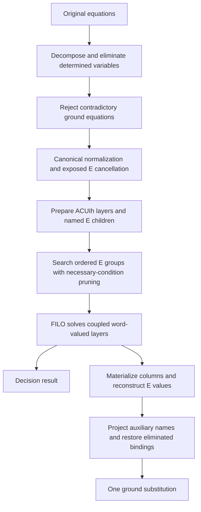

# Repository guide

Snapshot reviewed on 2026-09-13, against the files in the current worktree.

This repository develops a verified algebraic unification solver in Lean and an
OCaml frontend for a declarative hypergraph language. The frontend parses source
documents. OCaml programs can also call the Lean solver through a native C
bridge. Parsed programs are not yet connected to the solver.
Separate Lean developments establish an embedding of an HM typing system and
experiment with rigid quantified parameters.

The 2026-09-13 source inventory was 163 files and 21,258 lines across Lean, OCaml,
C, Python, and lexer/parser sources, excluding dependencies and build products.
There are 136 Lean files, including build configuration and benchmark modules.

**Current layout and entry points**

| Location | Responsibility |
| --- | --- |
| [ACUIhE/ACUIhE.lean](ACUIhE/ACUIhE.lean) | Umbrella import for the algebra, canonical representations, and solvers |
| [ACUIhE/ACUIhE/Solver/Decision.lean](ACUIhE/ACUIhE/Solver/Decision.lean) | Public full-signature `solve` and `isUnifiable` |
| [Hypergraph-ml/Hypergraph-lang.md](Hypergraph-ml/Hypergraph-lang.md) | Language specification, including intended semantics |
| [Hypergraph-ml/lib](Hypergraph-ml/lib) | Located AST, parser, diagnostics, and AST inspection printer |
| [Hypergraph-ml/ffi](Hypergraph-ml/ffi) | OCaml algebraic solver API and C ownership/conversion code |
| [Hypergraph-ml/lean/HypergraphFFI.lean](Hypergraph-ml/lean/HypergraphFFI.lean) | Versioned native exports of the existing Lean solver |
| [Hypergraph-ml/lean/HMEmbedding.lean](Hypergraph-ml/lean/HMEmbedding.lean) | Formal typing/unification embedding, built separately |
| [Hypergraph-ml/lean/QuantifierPrototype.lean](Hypergraph-ml/lean/QuantifierPrototype.lean) | Separate parameter-freezing experiment |
| [ACUIhE/Benchmarks](ACUIhE/Benchmarks) | Solver regression executable, fuzz supervisor, reports, retained measurements |
| [Hypergraph-ml/bench](Hypergraph-ml/bench) | Later solver optimization measurements using explicit algebraic constraints |

The worktree contains a large existing uncommitted reorganization. Git's tracked
snapshot uses older paths such as `ACUIHE/lean` and `hypergraph-ml`; the directories
on disk are `ACUIhE` and `Hypergraph-ml`. Earlier evaluator, type-checker,
analysis-extension, and standalone-packaging files are deleted in this worktree.
They are not active components of the current implementation. Git has
`core.ignorecase=true` here, so exact path casing matters when moving this work
to a case-sensitive filesystem.

**The algebra and its representations**

The signature in [Definition.lean](ACUIhE/ACUIhE/Definition.lean) is:

```text
t = 0 | constant | variable | t + t | h_label(t) | E(t)
```

Addition is associative, commutative, idempotent, and has identity zero. Each
named homomorphism distributes over addition and preserves zero. `E` preserves
zero and is injective. Homomorphism words retain their order and repetition.
Neither distributivity nor monotonicity is imposed on `E`, and the algebra
classes do not assume injective or commuting homomorphisms.

`Term.Equal` means equality in every model of the relevant theory. `Term.Below`
means `(a + b).Equal b`. An equation is just two stored terms; `Holds` tests an
interpretation, `Valid` quantifies over interpretations, and `Solved` additionally
requires ground syntax. These meanings live in `Equation/` and `Solution/`.
They must not be confused with finding a substitution that solves an equation.

The repository has three closely related signatures:

| Signature | Representation and solver |
| --- | --- |
| ACUIh: addition and homomorphisms | `ACUIhNF/` normal forms; `FILO/` unification |
| ACUIE: addition and `E` | Full graph representation with no homomorphism labels; `ACUIESolver/` unification |
| ACUIhE: the full signature | `Graph/` normal forms; `Solver/` unification |

An ACUIh normal form is `Finset (List Hom × Particle Const Var)`. Particles
distinguish constants from variables. The word `[h₁,h₂]` means `h₁(h₂(...))`.
Normalization unions summands and prefixes words. `ACUIhNF/linear/` builds a
noncommutative semiring of finite word sets, a semimodule action on normal forms,
and ground-substitution matrices. Variables index rows, constants index columns,
and each entry is a finite set of homomorphism words.

A full `Graph` is a quotient of finite tree-list presentations by recursive set
equality. Its layer is a finite set of word-labelled constants, variables, or
nonzero canonical `E` children. Empty children disappear because `E(0)=0`.
This representation describes algebraic normal forms; it is distinct from the
hypergraph values described by the language specification. It has no explicit
node-ID table or canonical storage-sharing layout.

`Graph.normalize` evaluates a term in that structural graph algebra.
`Graph.equivalent` compares normal forms using executable recursive set equality.
`Graph.layer` exposes a duplicate-free layer, and `Graph.fold` traverses `E`
children while keeping distinct original summands distinct even when their
computed results coincide. The fold does not promise memoization.

`Soundness.lean` and `Completeness.lean` connect derivations to universal semantic
equality through a quotient term model. `Graph/Normalization.lean` separately
proves that structural graphs characterize that same equality. `Transfer/`
connects quotient models and transports predicates that respect algebraic
equality. Raw reifiers that choose representatives are noncomputable; certified
enumeration interfaces and the normalizers/solvers are executable.

**The full solver's execution path**



1. `Solver/Decomposition.lean` exposes constructor shapes, separates additive
   components only when their outer signatures are disjoint, and cancels matching
   homomorphism prefixes in the free graph algebra. That last operation is proved
   at the unification boundary; it does not add injectivity to every model.
2. `ForcedMatching.lean` adds necessary equalities when a provably nonzero `E`
   child has exactly one compatible partner. It retains the original equation.
   Several children may match one partner, and optional children may vanish.
3. `Elimination.lean` substitutes explicitly determined variables throughout the
   entire problem and retains a restoration function. It revisits undetermined
   variables after each binding. Recursion strictly decreases the finite pending
   variable list. Self-reference disables this simplification rather than
   automatically rejecting unifiability.
4. `Normalization.lean`, `Cancellation.lean`, and
   `Graph/PresentationNormalization.lean` remove identities and duplicate
   oriented equation pairs, normalize summands, and recursively reduce exposed
   `E(A)=E(B)` or `E(A)=0`. Input-derived enumerations remain available for FILO.
5. `Preparation.lean` splits normalized terms into ACUIh layers and equations
   `root = E(child)`. Auxiliary names use `Var ⊕ Graph Const Var Hom`; equal
   canonical children share a name, and `E(0)` introduces none.
6. `Search.lean` calls the shared `ACUIESolver.Matching.GroupSearch`. Positive
   support and ordered groups describe possible `E` identifications and strict
   dependencies. Constants, shared variables, and all original equations stay
   coupled. Necessary positivity, dependency, and constant-provider checks prune
   branches without choosing arbitrary substitutions.
7. Shared `Matching/Rules.lean` expresses complete and pending `E` conditions.
   `WordRules.lean` translates them exactly into FILO inequalities and coordinate
   restrictions. An allowed `E` coordinate permits arbitrary homomorphism words;
   restricting coordinates is not the same as bounding a child by a bare atom.
8. `FILO/Deferred.lean` retains reconstruction plans during decision search.
   `Reconstruction.lean` uses the shared finite iteration to materialize `E`
   values. `Decision.lean` projects auxiliary names and restores eliminated
   variables. Completeness uses graph projection and child height in proofs;
   these are not runtime filters on candidate solutions.

The public contracts are:

```lean
Solver.solve p : Option (Var → Graph Const Empty Hom)
Solver.solve_sound p : Solver.solve p = some σ → p.IsSolution σ
Solver.solve_none_iff p : Solver.solve p = none ↔ ¬ p.Unifiable
Solver.isUnifiable_iff p : Solver.isUnifiable p = true ↔ p.Unifiable
```

`Unifiable` is independently defined using ordinary substitutions and universal
term equality. Grounding residual variables to zero proves equivalence with
ground graph solutions. The output is one satisfying ground substitution, with
no least-solution or most-general-unifier guarantee. The full Boolean API avoids
column/graph reconstruction. Public solver calls take no fuel limit,
correctness-proof argument, or candidate-validation oracle.

**The two fragment solvers**

`FILO/Preprocessing/` distributes and flattens terms, projects one constant
coordinate at a time, and introduces derivative/constant components over the
finite input role alphabet. `Choices/` classifies component languages as empty
(`top`), containing the empty word (`constant`), or nonempty without it
(`nothing`). It compiles necessary clauses, indexes names, builds occurrence
lists, propagates to a fixed point, and branches on remaining ambiguous domains.

`Goal/Implicit.lean` applies the implicit reduction rules. If no requirements
remain, `Goal/Starts.lean` reconstructs directly. Otherwise `Shortcuts/` generates
subsets of eligible active atoms and stores resolvers pointing to older entries.
The engine stops when the initial shortcut resolves or no new shortcut exists.
Reconstruction folds the stored table from oldest to newest. `Solver.lean`
assembles cached constant columns; `Coordinates.lean` adds exact support
restrictions needed by mixed `E` search. Strict finite decreases prove termination.

The standalone ACUIE solver uses the same ordered-group traversal and `E`
conditions, with finite-set layers instead of word-valued layers.
`Layers/Flat.lean` compiles membership constraints to Horn clauses about absent
memberships. `Layers/Horn.lean` computes their least absence model, whose
complement is the greatest satisfying membership assignment. It does not
enumerate all row assignments. `Matching/Reconstruction.lean` caches named terms.

`ACUIESolver/Finite/` retains the finite-table semantics and completeness
infrastructure; its `Search.lean` forwards to the current matching solver.
`Prototype`, `Reduction`, `Elimination`, `Branching/`, `Search`, and `Witness`
also expose earlier incremental/symbolic APIs. Their residual outcomes are not
failure answers, and they are not a fallback on the complete solver's path.
Unlike the full solver's dedicated Boolean path, standalone
`ACUIESolver.isUnifiable` is defined through the decision instance using `solve`.

**The language frontend and native boundary**

The CLI path is `hypergraph_cli.ml → Parse → Lexer/Parser → Ast`, followed by a
statement count or `Pp` AST dump. Neither mode invokes the solver.

The AST preserves source spans, arbitrary-size numeric spellings, constructor
arguments, annotations, declaration parameters, collection order, written edge
endpoints, edge direction, and optional payloads. It covers all six edge forms.
`&` binds tighter than `|` and `-`; arrows bind least tightly and cannot chain
without parentheses. `!` becomes the type name `Bottom`. Nested block comments
and CR/LF variants are handled by the lexer. Locations use byte positions and
exclusive ends. Pretty-printing is for AST inspection, not source round trips.

The parser does not resolve declarations or generate typing constraints.
Parser tests accept syntactically valid examples with invalid semantics.

The independent OCaml solver path is:

```text
Hypergraph.Solver (= Acuihe)
  → ffi/acuihe_stubs.c
  → acuihe_v1_* exports in HypergraphFFI.lean
  → ACUIhE.Solver
```

Constants, variables, and homomorphisms have separate namespaces of nonnegative
OCaml integer IDs. `Term.free` constructs `E`. Mixed inequalities compile
`Below(a,b)` to `a+b=b`. `Solution.get` returns ground canonical graphs; absent
variable IDs map to zero. `Graph.to_term` reconstructs through the public layer
view and can expand shared structure.

OCaml custom blocks own C-heap holders of reference-counted Lean objects.
Finalizers release them; consuming Lean calls receive retained references.
Initialization uses `pthread_once`, foreign threads receive Lean thread-local
initialization/teardown, and exported retained objects use atomic reference
counting. Long solver/graph operations release the OCaml runtime lock. Holders
stay at fixed addresses across compaction and root results through lock-transition
exceptions. The bridge checks ABI version 1, but structural decoding also depends
on the pinned Lean representations. Handles do not support Marshal or
polymorphic comparison. There is no native-call cancellation or search timeout.

**HM and quantifier developments**

`HMEmbedding/Types.lean` defines source monotypes and encodes arrows/products as
tagged `E` constructors with separately labelled fields. It proves equality
preservation/reflection, substitution compatibility, free-variable preservation,
and characterization of the HM-shaped target fragment.

`Typing.lean` defines schemes using finite sets of bound names, de Bruijn term
variables, and typing rules over independently specified source/target type
operations. `full_hm_embedding`, `instance_iff`, and `principal_iff` transfer typing,
instantiation, and principal-scheme status. `Solver.lean` proves that unrestricted
ACUIhE solving decides encoded HM equations using a well-founded retraction of
arbitrary graph solutions. `Examples.lean` checks independent polymorphic uses,
captures, shared-parameter conflicts, and the finite-type occurs case.

This proves an embedding of the defined pure rank-1 typing core. It does not
compute principal schemes or add a language inference algorithm. Higher-rank
polymorphism, polymorphic recursion, subtyping, and mutation are outside that core.

`QuantifierPrototype.lean` keeps free unknowns and bound parameters in disjoint
namespaces. `freeze` turns parameters into fresh rigid constants for checking;
`instantiate` substitutes only bound parameters. It proves the scope operations
and examples, including rejection of captured-variable conflicts. It does not
infer which variables may be generalized.

**Build, tests, and proof checks**

Both Lean projects pin `leanprover/lean4:v4.33.1`; mathlib is pinned to the matching
release and a concrete manifest revision. The adapter requires the sibling
`../../ACUIhE` project and shares its `.lake/packages`. The local environment used
for this review has OCaml 5.4.1 and Dune 3.19.1.

Run the Lean core and regressions from `ACUIhE/`:

```sh
lake build ACUIhE acuihe acuihe_bench acuihe_optimization_tests
.lake/build/bin/acuihe_optimization_tests
```

Run the frontend and native bridge from `Hypergraph-ml/`:

```sh
dune build
dune runtest --force
dune exec bin/hypergraph_cli.exe -- --ast examples/basic.hg
```

Run the separate formal experiments from `Hypergraph-ml/lean/`:

```sh
lake build HMEmbedding
lake env lean QuantifierPrototype.lean
```

`tools/build_lean.py` checks toolchain alignment and asks Lake for the FFI module's
native import closure. Lake produces a static archive and a bytecode-loadable
shared object. Dune receives generated include/link flags; native executables
still dynamically depend on the pinned Lean runtime. The `(universe)` dependency
causes Lake to recheck sibling inputs on Dune invocations. The build assumes a
POSIX environment and this sibling directory layout.

Verification performed for this snapshot:

| Check | Observed result |
| --- | --- |
| Lean library and all three declared executables | Build passed using existing local dependencies |
| Library import coverage | Umbrella import reaches 124 of 125 library modules; the remaining forwarding module `FILO.Shortcuts.Search` was built explicitly |
| Optimization regression executable | All 31 cases passed; decisions and returned witnesses checked against original equations |
| Dune build | Passed |
| Forced Dune test run | Passed: 16 parser groups, all 23 specification `hg` blocks, CLI cram tests, native/bytecode FFI suites, system threads, and OCaml 5 domains |
| HM embedding and executable guards | Passed |
| Quantifier prototype and executable guards | Passed |
| Benchmark supervisor smoke run | 18 generated inputs × decision/witness = 36 successful runs, with no mismatches or timeouts |
| Saved benchmark integrity | 26 cohorts with standard metadata passed complete-grid and known-answer checks; five historical primary comparisons passed exact-input/ordering pairing checks |
| Lean source scan | No proof holes, custom axiom declarations, unsafe definitions, or `native_decide` occurrences found in project Lean source |

The public solver, normal-form, fragment, and FFI proof audit reports only
`propext`, `Classical.choice`, and `Quot.sound`, or subsets. HM and quantifier
audits report the same foundational boundary. These proofs establish the Lean
definitions' mathematical contracts; C ownership, ABI conversion, OCaml parsing,
and compiled runtime behavior also depend on their implementations and execution
tests. No new clean dependency download or cross-platform build was performed.

Builds emit a nonfatal unused-section-variable linter warning in
`Solver/Search.lean` and local linker/Xcode environment warnings. The core
`acuihe` executable currently prints `Hello, World!`; it is not a solver CLI.
The functional entry points are the Lean library, OCaml API, parser CLI, and
benchmark worker.

**Benchmarks and operational gaps**

`Benchmarks/Fuzz.lean` accepts one JSON request containing prefix-encoded equations,
signals `ready` after parsing, waits for `go`, then measures the full solver.
Decision mode skips witness extraction; witness mode queries declared variables
and traverses their graphs. `fuzz.py` runs serial fresh processes and enforces a
post-handshake wall deadline. Its parser budget is derived from input length and
does not bound the solver search.

The Python generator includes planted SAT, independently justified UNSAT, and
unconditioned random cases. Its independent ground normalizer checks planted
witnesses. Runs retain cases, observations, metadata, and summaries. Reports use
completion rates, conditional completed times, and capped wall costs; timeouts
remain unknown. `compare.py` verifies exact pairing before comparing saved runs.
`coupled_replay.py` replays connected deterministic systems. The two old scripts
inside `results/coupled-baseline/` contain machine-specific paths and write beside
their retained data; use the top-level replay tools with a new output directory.

The retained primary 0.5-second cohorts progress from 641/1,080 completions to
966, 991, 1,055, and then 1,075 in the September 12 optimization records.
The final forced-matching cohort retains 1,075 completions. These counts were
checked against raw records. Later type-shaped/coercion probes are explicitly
constructed solver equations, not evidence of an implemented source-language
type checker. Large union/`E` cycles and some homomorphism cases remain slow.

Historical cohort executable hashes differ from the executable built during this
review. The saved results therefore describe those recorded builds; the new
36-run smoke check verifies harness operation and is not a performance study.
No general complexity or representative-workload speed claim follows from these
synthetic measurements.

The only project GitHub workflow is nested at
`ACUIhE/.github/workflows/lean_action_ci.yml`; there is no root `.github/workflows`
configuration in this Git worktree. No root build orchestrator, OCaml package
manifest, or license file was found. Separate explicit commands are needed for
the HM and quantifier checks. The main remaining product work is the semantic
frontend connecting the specified language to the available algebraic solver.
